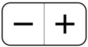
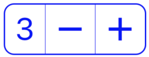

# react-native-simple-stepper

[](https://reactnative.dev)
[](https://www.npmjs.com/package/react-native-simple-stepper)
[](https://www.npmjs.com/package/react-native-simple-stepper)
[](https://raw.github.com/testshallpass/react-native-simple-stepper/master/LICENSE)
[](https://github.com/testshallpass/react-native-simple-stepper/actions/workflows/ci.yml)

A parity version of the iOS [UIStepper](https://developer.apple.com/reference/uikit/uistepper).



## Table of contents

- [Installation](#installation)
- [Usage](#usage)
- [Text Position](#text-position)
- [Props](SimpleStepper.tsx)
- [More Examples](./example/App.tsx)

## Installation

|                                                  |
| ------------------------------------------------ |
| `yarn add react-native-simple-stepper`           |
| `npm install react-native-simple-stepper --save` |

## Usage

```javascript
import SimpleStepper from 'react-native-simple-stepper';

function Example() {
  return <SimpleStepper valueChanged={value => console.log(value)} />;
}

export default Example;
```

## Text Position

|                 left                  |            center (default)             |                 right                  |
| :-----------------------------------: | :-------------------------------------: | :------------------------------------: |
|  |  |  |

```javascript
import SimpleStepper from 'react-native-simple-stepper';

function TextPositionExample() {
  return <SimpleStepper showText={true} textPosition={'right'} />;
}

export default TextPositionExample;
```
